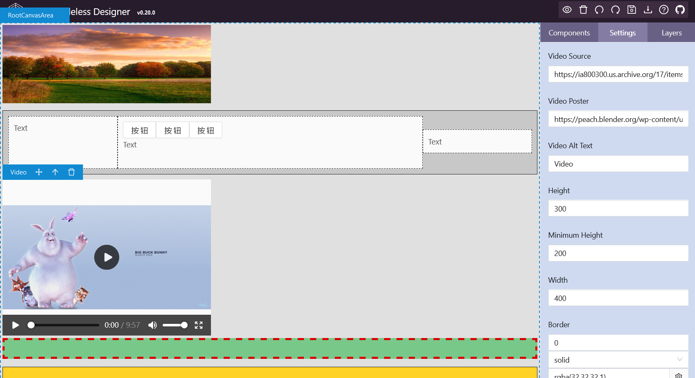

<p align="center">
    
</p>

<h1 align="center">CCD: Craft Codeless Designer</h1>

## 1.简介

Craft Codeless Designer 是一款可视化的低代码/零代码页面设计器，基于 craft.js 扩展而来。

🚀 [在线实例](https://craft-codeless-designer.github.io/craft-codeless-designer/)

## 2.用法

- 在你的 React 项目中安装依赖： yarn add craft-codeless-designer
- 引用 &lt;CraftDesigner&gt; 组件

```javascript
render() {
    //只要给 CraftDesigner 传递 pageData 参数，它自己会反序列化成页面。
    const pageData = this.state.pageEntity.pageData;
    return (
        <CraftDesigner
            onSaveData={this.onSaveData.bind(this)}
            onLoadData={this.loadData.bind(this)}
            onPreview={this.onPreview.bind(this)}
            pageData={pageData}
            ></CraftDesigner>
    );
}
```

完整的实例项目参见： https://github.com/craft-codeless-designer/craft-codeless-designer-demo

## 3.核心 API

**&lt;CraftDesigner&gt; 是唯一的核心组件，它集成了所有功能。**

&lt;CraftDesigner&gt; 核心 props 说明：

| props          | 说明                                                                           |
| -------------- | ------------------------------------------------------------------------------ |
| onPreview      | 预览按钮回调函数                                                               |
| onDelete       | 删除按钮回调函数                                                               |
| onUndo         | Undo 按钮回调函数                                                              |
| onRedo         | Redo 按钮回调函数                                                              |
| onSaveData     | 保存 按钮回调函数                                                              |
| onLoadData     | 加载 按钮回调函数                                                              |
| onHelp         | Help 按钮回调函数                                                              |
| showNavBar     | 是否渲染顶部导航条，默认为 true                                                |
| showSiderBar   | 是否渲染侧边工具栏，默认为 true                                                |
| componentTypes | 组件类型列表， CraftDesigner 内置的组件已经全部添加在列表中                    |
| iconList       | 组件图标列表， CraftDesigner 内置的图标已经全部添加在列表中                    |
| pageData       | 页面数据，传递和修改 pageData 会触发 CraftDesigner 重新渲染页面                |
| enabled        | 是否启用编辑状态，默认为 true ，如果需要进入预览状态，请把此配置项设置为 false |

## 4.继续开发

- git clone 此项目
- yarn install
- npm start

此工程使用 storybook 编写测试用例和文档。

## 5.主要优点

- 支持无限嵌套布局，可以设计出结构非常复杂的页面
- 支持所有原生 HTML 标签拖拽布局
- 支持任意 React 组件拖拽布局，包括开源组件，无需对现有组件进行修改
- 支持 iframe 嵌入组件
- 支持 ECharts 图形拖拽布局
- 整个页面序列化成 JSON 数据，不生成代码
- CraftDesigner 自身也是一个普通的 React 组件，可以被随意集成到任意 React 项目中
- CraftDesigner 自身是服务端无关的，只输出和输入 JSON 数据

## 6.效果图


<br/>
<br/>

<br/>
<br/>

<br/>
<br/>

<br/>
<br/>


## 7.主要依赖

- [craft.js](https://github.com/prevwong/craft.js)
- [Ant Design](https://ant.design)
- [React](https://reactjs.org/)
- [storybook](https://github.com/storybookjs/storybook)
- [react-markdown](https://github.com/remarkjs/react-markdown)

## 8.License

[MIT licensed](./LICENSE).
