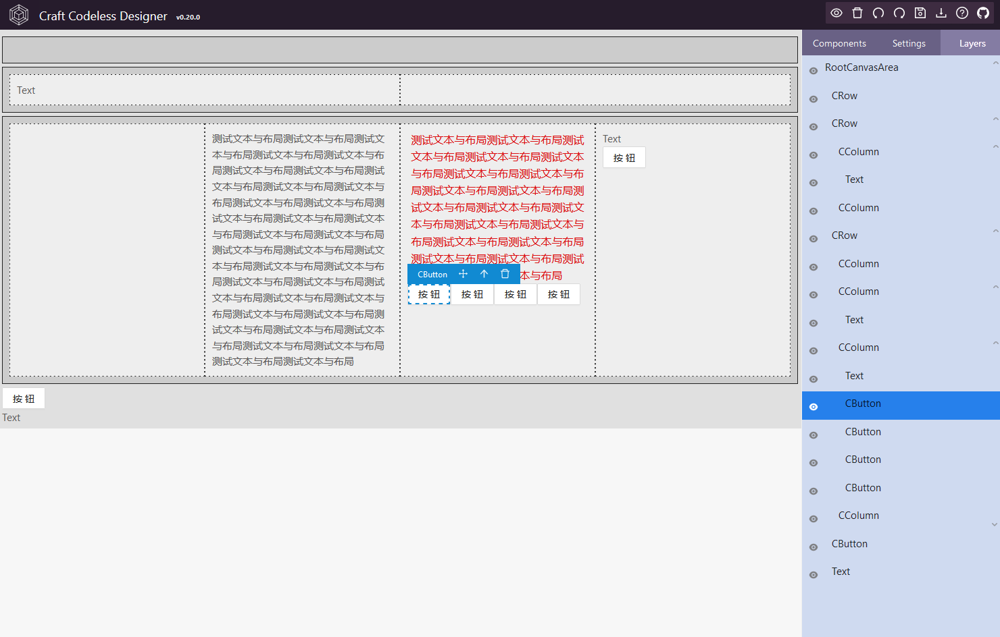

<p align="center">
    
</p>

<h1 align="center">CCD: Craft Codeless Designer</h1>

## 1.简介

Craft Codeless Designer 是一款可视化的低代码/零代码页面设计器，基于 craft.js 扩展而来。

## 2.用法

- 在你的 React 项目中安装依赖： yarn add craft-codeless-designer (or npm install craft-codeless-designer --save)
- 引用 CraftDesigner 组件

```javascript
render() {
    //只要给 CraftDesigner 传递 pageData 参数，它自己会反序列化成页面。
    const pageData = this.state.pageEntity.pageData;
    return (
        <CraftDesigner
            onSaveData={this.onSaveData.bind(this)}
            onLoadData={this.loadData.bind(this)}
            onPreview={this.onPreview.bind(this)}
            pageData={pageData}
            ></CraftDesigner>
    );
}
```

完整的项目实例参见： https://github.com/craft-codeless-designer/craft-codeless-designer-demo

## 3.继续开发

- git clone 此项目
- yarn install
- npm start

此工程使用 storybook 编写案例和文档。

## 4.优点

- 支持所有原生 HTML 标签
- 支持任意 React 组件，包括开源组件，无需对现有组件进行修改
- 支持 iframe 嵌入组件
- 支持 ECharts 图形拖拽布局
- 整个页面序列化成 JSON 数据，不生成代码
- Designer 自身也基于 React 编写
- Designer 可定制性高
- Designer 自身也是一个 React Component 可以随意嵌入到现有页面中

## 5.效果图


<br/>
<br/>

<br/>
<br/>

<br/>
<br/>

<br/>
<br/>


## 6.主要依赖

- [craft.js](https://github.com/prevwong/craft.js)
- [Ant Design](https://ant.design)
- [React](https://reactjs.org/)

## 7.License

[MIT licensed](./LICENSE).

```

```
