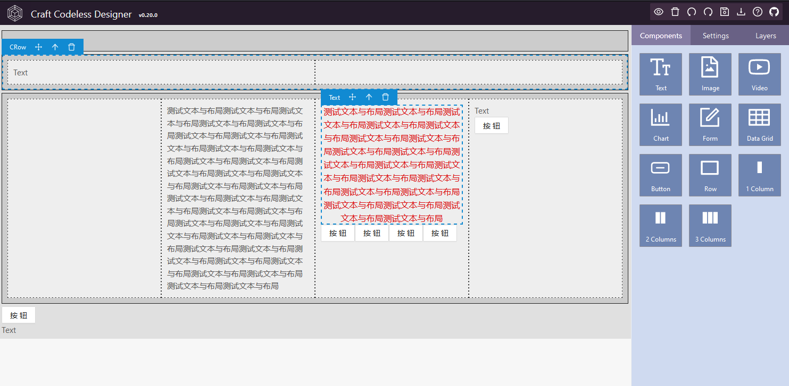

    

<h1 align="center">CCD: Craft Codeless Designer</h1>

## 1.简介

Craft Codeless Designer 是一款可视化的低代码/零代码页面设计器，基于 craft.js 扩展而来。

## 2.用法

    clone this repo
    cd craft-codeless-designer
    yarn install
    npm start

## 3.ScreenShots

 
 

 
 

 
 

## 4.主要依赖

- [craft.js](https://github.com/prevwong/craft.js)
- [Ant Design](https://ant.design)
- [React](https://reactjs.org/)

## 5.定制开发

联系我的 WX 号：lanxinshuma ，备注：codeless 。

## 6.License

[MIT licensed](./LICENSE).
